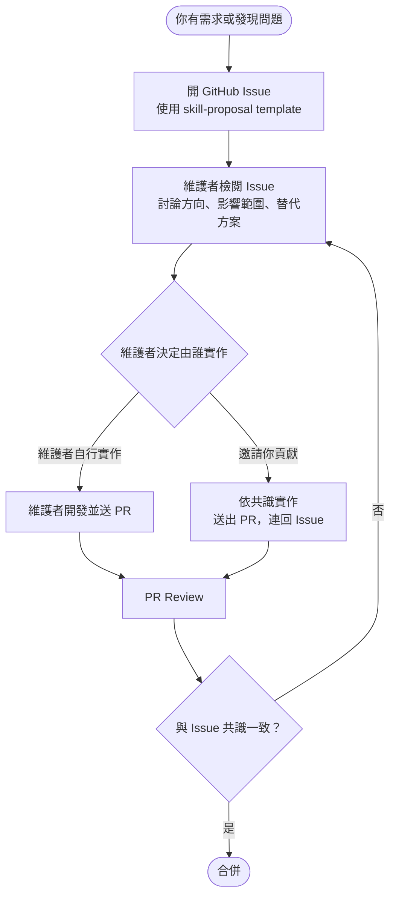

# Contributing to Skills

這份文件說明如何對本 repo 的 skill 發起需求、回報問題，以及在什麼條件下可以參與實作與送出 PR。

Skill 會影響團隊日常開發流程與輸出品質，因此任何新增或修改都需要遵循以下流程。

---

## 貢獻流程



---

## Step 1：開 GitHub Issue

1. 前往 repo 的 [Issues](../../issues) 頁面，點擊 **New Issue**
2. 選擇 **Skill Proposal** template
3. 填寫以下欄位（缺少任一項，維護者可能要求補充才能繼續討論）：

   | 欄位 | 說明 | 範例 |
   |---|---|---|
   | **背景與使用情境** | 你在做什麼，遇到什麼問題 | 每次手動整理 YouTrack 週報要花 30 分鐘 |
   | **現況與痛點** | 現有 skill 缺了什麼 | 目前沒有自動化工具，需要手動複製貼上 |
   | **預期結果** | 希望新增或修正成什麼樣子 | 執行一個指令，自動產出 Markdown 週報 |
   | **影響範圍** | 可能受影響的工作流程或團隊 | 所有使用 YouTrack 的開發團隊 |
   | **參與意願** | 是否願意在方向確認後自行提交 PR | ✅ 願意 / ❌ 希望維護者處理 |

4. 送出 Issue，等待維護者回應

> **例外**：明顯的 typo 修正或純文件補充，可直接送 PR，不需要先開 Issue。
> 但若修正反映的是流程或行為定義的改變，仍應先開 Issue。

---

## Step 2：參與 Issue 討論

維護者會在 Issue 中討論以下問題，請積極回應：

- 這個需求是否適合放在這個 repo？
- 是否已有現有 skill 可以重用或擴充？
- 是否有更小、風險更低的替代方案？
- 這項變更是否會影響現有 skill 的行為？

討論結束後，維護者會在 Issue 中明確說明：
- ✅ **同意新增/修改**，並決定由誰實作
- ❌ **不採納**，並說明原因

---

## Step 3：實作（若被邀請貢獻）

維護者在 Issue 中明確表示歡迎貢獻後，才開始實作：

1. **建立功能分支**

   ```bash
   git checkout -b <skill-name>-<簡短描述>
   # 範例：git checkout -b audit-skill-add-security-check
   ```

2. **撰寫或修改 SKILL.md**（格式規範請參考現有 skill）

3. **在 SKILL.md frontmatter 加入 `issue:` 欄位**

   ```yaml
   ---
   name: <skill-name>
   description: "..."
   tags: [...]
   issue: "https://github.com/<org>/<repo>/issues/<number>"
   ---
   ```

4. **執行 `audit-skill` 確認無風險項目**

   > 觸發語句：「稽核 skill」或「/audit-skill」

5. **使用 `create-pr` 建立 PR**，PR 描述中連結對應 Issue

   > 觸發語句：「幫我建立 PR」或「/create-pr」

---

## Step 4：PR Review

- PR 的實作範圍必須對齊 Issue 中已確認的共識
- 若開發途中發現方向需要改變，**回到原 Issue 討論**，不要直接在 PR 中改規格
- Reviewer 若發現與共識不一致，會要求回 Issue 重新確認

---

## What Not to Do

- ❌ 直接送出尚未討論的功能型 PR
- ❌ 在沒有 Issue 背景的情況下，直接改動現有 skill 的行為
- ❌ 在 PR 中才首次提出重要設計決策
- ❌ 已在 Issue 中形成共識，卻在實作時自行擴大 scope
- ❌ 在 SKILL.md 中 hardcode token、secret 或內部 URL
